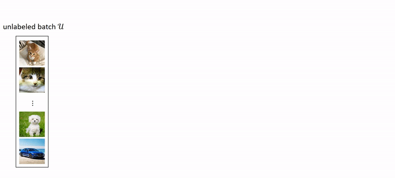

## CoMatch: Semi-supervised Learning with Contrastive Graph Regularization (Salesforce Research), Accepted by ICCV 2021!

This is a PyTorch implementation of the <a href="https://arxiv.org/abs/2011.11183">CoMatch paper</a> <a href="https://blog.einstein.ai/comatch-advancing-semi-supervised-learning-with-contrastive-graph-regularization/">[Blog]</a>:
<pre>
@article{CoMatch,
	title={Semi-supervised Learning with Contrastive Graph Regularization},
	author={Junnan Li and Caiming Xiong and Steven C.H. Hoi},
	journal={arXiv preprint arXiv:2011.11183},
	year={2020}
}</pre>

### Requirements:
* PyTorch ≥ 1.4
* pip install tensorboard_logger
* download and extract <a href="https://www.cs.toronto.edu/~kriz/cifar.html">cifar-10 dataset</a> into ./data/ 

To perform semi-supervised learning on CIFAR-10 with 4 labels per class, run:
<pre>python Train_CoMatch.py --n-labeled 40 --seed 1 </pre> 

The results using different random seeds are:

seed| 1 | 2 | 3 | 4 | 5 | avg 
--- | --- | --- | --- | --- | --- | --- 
accuracy|93.71|94.10|92.93|90.73|93.97|93.09

### ImageNet
For ImageNet experiments, see ./imagenet/

